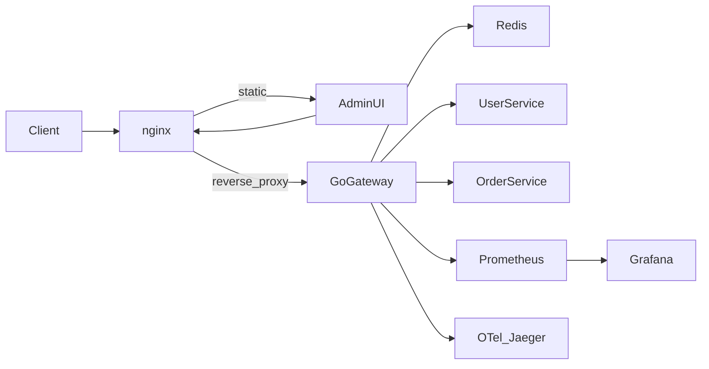

# Resume API Gateway

A custom gateway you **built**, not Kong/Traefik. That is the resume story: you understand the proxy path, auth, limits, failure handling, and how you observe it.

## What you will be able to demo

- `docker compose up` → hit `/users` and `/orders` through the gateway
- Reject unauthenticated requests; accept JWT **or** an API key
- Rate-limit a key until you get `429`
- Flip a mock service to fail and watch the **circuit breaker** open in Grafana
- Follow one request in **Jaeger** (nginx → gateway → service)
- Open a small **admin UI** to create/revoke keys and see upstream health
- Point at GitHub Actions + k8s YAML even if you run Compose locally / on a VPS

## Architecture



Request path: **TLS/static at nginx** → **policy at the Go gateway** (auth, rate limit, circuit breaker, proxy) → **mock services**. Redis holds rate-limit counters and API keys. Postgres is intentionally omitted so a later VPS deploy stays cheap.

## Resume-facing stack

| Layer | Choice | Why it belongs on a resume |
|---|---|---|
| Edge | nginx (Alpine) | TLS, security headers, static admin + OpenAPI, gzip |
| Gateway | Go 1.22+ `net/http` + `httputil.ReverseProxy` | Stdlib mux and middleware; no chi/gin/echo |
| Auth | JWT (`golang-jwt`) + hashed API keys | Two schemes, scopes per route |
| Limits | Redis token bucket | Distributed limiter, not an in-memory toy |
| Resilience | Your own circuit breaker | Classic interview topic you can explain line-by-line |
| Metrics | Prometheus + Grafana | RED metrics, breaker state, 429s |
| Traces | OpenTelemetry → Jaeger | Correlation IDs across hops |
| Admin | Small Vite + React SPA | Create/revoke keys, route/upstream health |
| Run | Docker Compose | One-command demo |
| “I know k8s” | Manifests + kustomize | Deployments, Services, ConfigMaps, Ingress — unused until you want them |
| CI | GitHub Actions | `go test`, `golangci-lint`, image build |

## Repo layout (empty workspace)

```
cmd/gateway/          # gateway process
cmd/usersvc/          # mock users API
cmd/ordersvc/         # mock orders API (can be set flaky for breaker demos)
internal/
  auth/               # JWT validate + API key lookup
  ratelimit/          # Redis token bucket
  circuitbreaker/     # per-upstream closed/open/half-open
  proxy/              # ReverseProxy + path rewrite
  middleware/         # func(http.Handler) http.Handler — request ID, recover, access log
  config/             # YAML route table
  metrics/            # Prometheus
  tracing/            # OTel setup
web/admin/            # Vite + React admin SPA
nginx/nginx.conf
configs/gateway.yaml
deploy/compose.yml
deploy/k8s/           # kustomize base
deploy/prometheus/    # scrape configs + Grafana dashboard JSON
.github/workflows/ci.yml
docs/openapi.yaml
```

## Gateway behavior

YAML-driven routes in [`configs/gateway.yaml`](configs/gateway.yaml), roughly:

```yaml
listen: ":8080"
upstreams:
  users:  { url: "http://usersvc:8081" }
  orders: { url: "http://ordersvc:8082" }
routes:
  - path: "/users*"
    upstream: users
    auth: jwt_or_apikey
    scopes: ["users:read"]
    rate_limit: { rps: 10, burst: 20 }
  - path: "/orders*"
    upstream: orders
    auth: jwt_or_apikey
    scopes: ["orders:read"]
    rate_limit: { rps: 5, burst: 10 }
```

Middleware order (this is the interview diagram):

1. Request ID + access log (JSON)
2. Prometheus + OTel span
3. Auth (Bearer JWT **or** `X-API-Key`; keys stored as SHA-256 hashes in Redis)
4. Per-key / per-IP rate limit → `429` + `Retry-After`
5. Circuit breaker for that upstream → `503` when open
6. Reverse proxy; strip prefix if configured

Admin API lives on the same binary under `/admin/*`, protected by a separate admin JWT. The SPA calls it to mint keys, revoke keys, and read upstream health + breaker state.

Mock services stay tiny: CRUD-ish JSON, health endpoints, and `FAIL_RATE` on orders so you can demo the breaker without a third service.

## HTTP stack (stdlib only — no chi)

Go 1.22+ `http.NewServeMux` mounts gateway-owned paths only:

- `GET /healthz`, `GET /readyz`
- `GET /metrics`
- `/admin/` → admin API (`POST /admin/keys`, revoke, upstream health)
- catch-all `/` → YAML matcher → middleware chain → `httputil.ReverseProxy`

Proxied traffic is **not** one mux pattern per backend. A small matcher walks `configs/gateway.yaml` (prefix/glob) and picks the upstream. That is the real router; ServeMux is process plumbing.

Middleware is the stdlib pattern — `func(http.Handler) http.Handler` — composed in a tiny `chain()` helper (wrap last-to-first). No `chi.Use`, no framework context.

Mock services (`usersvc`, `ordersvc`) also use `http.NewServeMux` with Go 1.22 patterns (`GET /users/{id}`). No chi/gin/echo modules anywhere.

## nginx role (keep it real, not decorative)

- Terminate TLS (self-signed in Compose; documented certbot/Let’s Encrypt for VPS)
- Proxy `/api/` → gateway, `/admin/` → SPA, `/docs/` → OpenAPI
- Security headers, gzip, access log
- Modest edge `limit_req` so you can talk about **defense in depth** (edge + app)

## Observability you can screenshot

- Prometheus histograms: request count, latency, status class, rate-limit hits, breaker transitions
- One Grafana dashboard JSON checked in
- OTel traces from gateway **and** both mock services, same `traceparent`
- Structured logs include `request_id` + `trace_id`

## Tests (do these; recruiters open the `*_test.go` files)

- Unit: token bucket, breaker state machine, JWT/scope checks
- `httptest`: route table, 401/429/503, happy-path proxy to a stub upstream

## CI and “cloud later”

- GitHub Actions: test + lint + `docker build` (no deploy)
- Compose: all services, named networks, healthchecks, restart policies, env files — this is what you run on a $5–6 VPS
- k8s YAML is the extra talking point, not the default run path
- No hardcoded `localhost` in app config; everything via env / Compose DNS

## What we will not build in v1

Service mesh, gRPC, Kafka, Postgres, Terraform, billing/quotas. Those dilute a project you need to finish and demo.

## Build order

Work in vertical slices so you always have something runnable.

1. **Core proxy** — `net/http` ServeMux + YAML routes + two mock services + Compose (no auth yet)
2. **Auth + Redis limits** — JWT, API keys, token bucket, tests
3. **Breaker + OTel + Prometheus/Grafana** — flaky orders, dashboards, traces
4. **nginx + admin SPA + OpenAPI** — the demo surface
5. **CI, k8s manifests, README** — architecture diagram, quick start, design notes, VPS TLS checklist

## README (treat this as part of the product)

Architecture diagram, `docker compose up` in under 10 lines, feature list with “why I built it this way,” Grafana/Jaeger screenshots, and a short VPS section (DNS, certbot, env secrets). That write-up is often what gets you the interview.